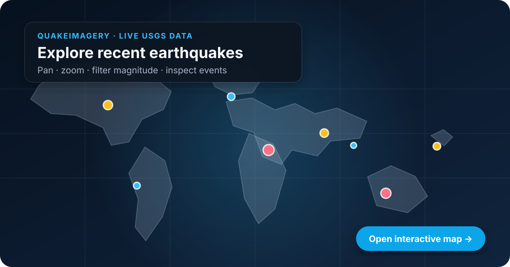

# QuakeImagery

[](https://github.com/ZuhairQuakes/interactive-web-app/actions/workflows/quality.yml)
[](LICENSE)
[](https://www.python.org/downloads/)

An interactive Streamlit application for querying the USGS Earthquake Catalog, exploring clustered earthquake events, and optionally overlaying a user-supplied georeferenced GeoTIFF.

## Live earthquake map

[](https://htmlpreview.github.io/?https://github.com/ZuhairQuakes/interactive-web-app/blob/main/docs/index.html)

**[Open the interactive map →](https://htmlpreview.github.io/?https://github.com/ZuhairQuakes/interactive-web-app/blob/main/docs/index.html)**

Pan, zoom, inspect event details, and filter the current results by magnitude. Prominent events are labelled with magnitude and UTC date, while every marker reveals the same annotation on hover. The demo loads the official [USGS M4.5+ earthquake feed for the past 30 days](https://earthquake.usgs.gov/earthquakes/feed/v1.0/summary/4.5_month.geojson) at runtime, so no stale sample catalogue is stored in the repository. The README preview combines current USGS events with an accurate [Natural Earth](https://www.naturalearthdata.com/) world basemap.

GitHub README files cannot execute interactive JavaScript directly. The preview above therefore opens the standalone Leaflet map through GitHub HTML Preview.

## Features

- Query earthquake events by date range, minimum magnitude, result limit, and geographic bounds.
- Explore magnitude, depth, origin time, and location in a clustered Folium map.
- Upload an optional EPSG:4326 GeoTIFF and process it in memory—no server-side path is required.
- Download the current interactive map as a self-contained HTML file.
- Cache identical USGS requests for 15 minutes to reduce unnecessary service traffic.
- Validate query bounds, USGS failures, response structure, raster size, and coordinate reference system.

QuakeImagery does **not** download imagery from NASA or another imagery provider. Imagery acquisition and scientific preprocessing remain the user's responsibility.

## Installation

Install the latest source release in an isolated environment:

```bash
git clone https://github.com/ZuhairQuakes/interactive-web-app.git
cd interactive-web-app
python -m venv .venv
source .venv/bin/activate
python -m pip install .
quakeimagery
```

On Windows PowerShell, activate the environment with `.venv\Scripts\Activate.ps1`.
Python 3.10 or newer is required. Open the URL shown by Streamlit, choose a query
in the sidebar, and select **Fetch earthquakes**. The optional raster uploader
accepts `.tif` and `.tiff` files up to 50 MB.

The application can also be run from a source checkout with
`streamlit run streamlit_app.py`.

## Imagery requirements

Uploaded imagery must:

- be a valid GeoTIFF with an embedded coordinate reference system;
- use EPSG:4326 longitude/latitude coordinates;
- contain at least one raster band; and
- be no larger than 50 MB.

Large rasters are resampled to approximately two million display pixels. One-band rasters are rendered as grayscale; the first three bands of multiband rasters are treated as RGB and contrast-stretched using the 2nd and 98th percentiles. This rendering is for exploration, not quantitative remote-sensing analysis.

## Repository map

| Path | Purpose |
| --- | --- |
| [`streamlit_app.py`](streamlit_app.py) | Streamlit interface and application state |
| [`quakeimagery/usgs.py`](quakeimagery/usgs.py) | validated USGS query model and GeoJSON normalization |
| [`quakeimagery/imagery.py`](quakeimagery/imagery.py) | safe in-memory GeoTIFF loading and display normalization |
| [`quakeimagery/mapping.py`](quakeimagery/mapping.py) | Folium event markers and raster overlays |
| [`quakeimagery/cli.py`](quakeimagery/cli.py) | installed `quakeimagery` application launcher |
| [`docs/index.html`](docs/index.html) | standalone live-USGS Leaflet map linked from the README |
| [`scripts/generate_map_preview.py`](scripts/generate_map_preview.py) | rebuilds the accurate README preview from Natural Earth and USGS GeoJSON |
| [`tests/`](tests/) | unit tests for queries, parsing, imagery, and map construction |
| [`requirements.txt`](requirements.txt) | runtime dependencies |

## Development

```bash
python -m pip install -e ".[dev]"
ruff check .
pytest
python -m build
python tools/validate_repository.py
```

The same checks run automatically for every push and pull request. See [`CONTRIBUTING.md`](CONTRIBUTING.md) before proposing changes.

## Open-source community

QuakeImagery is released under the permissive [MIT License](LICENSE). Bug
reports, focused feature requests, documentation improvements, and tested code
contributions are welcome.

- Read the [contribution guide](CONTRIBUTING.md) and [Code of Conduct](CODE_OF_CONDUCT.md).
- Use the [issue tracker](https://github.com/ZuhairQuakes/interactive-web-app/issues) for reproducible bugs and scoped proposals.
- Follow the [security policy](SECURITY.md) for private vulnerability reports.
- See the [changelog](CHANGELOG.md) for release history and [`CITATION.cff`](CITATION.cff) for research citation metadata.

## Data sources and limitations

Earthquake events come from the [USGS FDSN Event Web Service](https://earthquake.usgs.gov/fdsnws/event/1/). The standalone map uses the USGS [real-time GeoJSON summary feed](https://earthquake.usgs.gov/earthquakes/feed/v1.0/geojson.php). Queries are capped at 20,000 events, consistent with the service limit. Event records can be revised by USGS after retrieval, so scientific outputs should record the query parameters, retrieval time, and Git commit.

QuakeImagery is an exploratory visualization tool. It does not calculate earthquake probability, damage, surface deformation, or an official hazard assessment.
